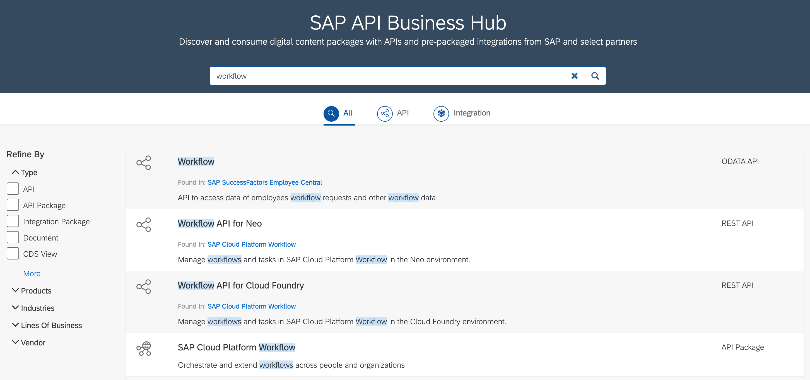
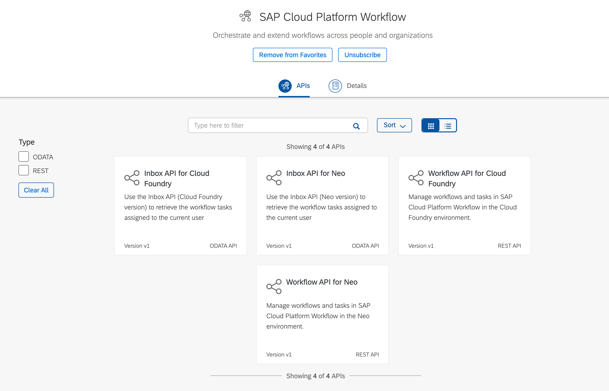
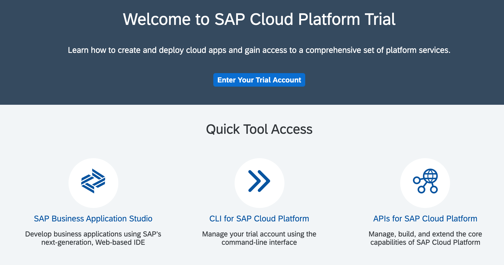
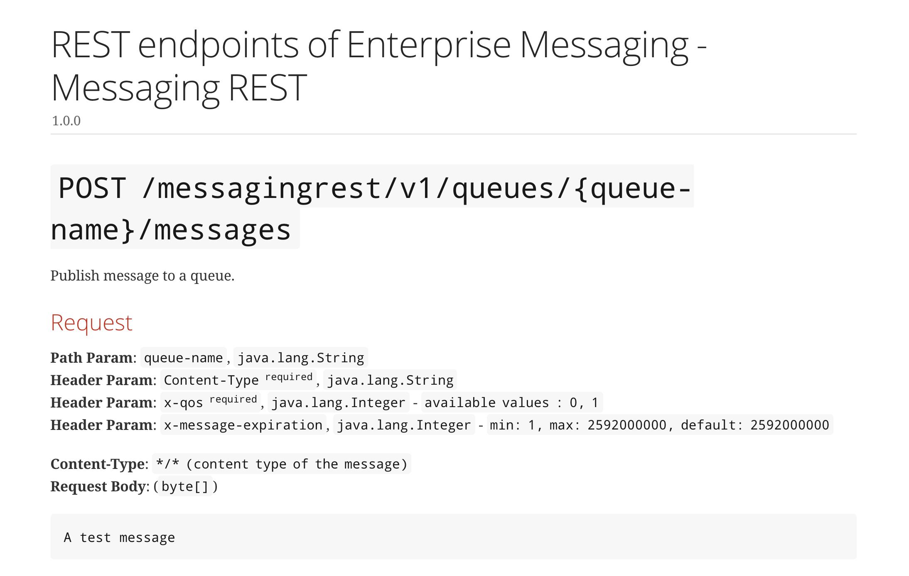

# Exercise 01 - Get an overview of API resources

In this exercise you'll get an overview of some of the Application Programming Interfaces (APIs) available on SAP Cloud Platform, and of the OAuth 2.0 based authentication approach used to protect them.


## Steps

After completing the steps in this exercise you'll be famililar with places where SAP Cloud Platform APIs are documented, and understand the basics of OAuth 2.0 authentication.

### 1. Get an introduction to the SAP API Business Hub

There are many services available on SAP Cloud Platform, and most of these have APIs that can be used to access those services' facilities programmatically. The canonical "home" of API information for SAP services generally is the [SAP API Business Hub](https://api.sap.com/), or API Hub for short.

:point_right: Go to the [API Hub](https://api.sap.com) and log in using your SAP Cloud Platform trial account (a trial account is a [prerequisite](../prerequisites.md) for this virtual event).

At this point you can have a look around and get a feel for what the API Hub has to offer. Note that the API Hub has different content types, such as Business Processes, APIs, Events, Integration and more.

:point_right: To dig in a little deeper, let's pick a service - Workflow. Search for APIs for Workflow by entering the term in the search box. You should see results that look something like this:



There are a number of important things to note in this list of results:

- you can refine the search results by type (see the list in the left hand column)
- there are APIs (denoted by the three circles symbol) and API packages (denoted by the symbol containing the globe)
- within the context of the APIs, there are REST APIs and OData APIs
- there are currently Workflow APIs for different environments - in this example we see APIs for Neo & for Cloud Foundry

:point_right: Select the "[SAP Cloud Platform Workflow](https://api.sap.com/package/SAPCPWorkflowAPIs?section=Artifacts)" API Package and you're taken to the list of artifacts. At the time of writing, there are four presented, as can be seen in the screenshot; again, note the details across each of them - versions, API type, and environment:



:point_right: Finally in this step, dig one level deeper by selecting a specific API artifact. Choose the Workflow API for Cloud Foundry (the REST API) and have a brief look at the details shown.

Note that there are many API endpoints, and they are grouped together logically. You can see these groups in the left hand column; for the [Workflow API for Cloud Foundry](https://api.sap.com/api/SAP_CP_Workflow_CF/resource) that you've selected, there are the following groups of endpoints:

- User Task Instances
- Task Definitions
- Workflow Definitions
- Workflow Instances
- Forms
- Data Export
- Purge
- Jobs
- Messages

:point_right: Before finishing with this step, take a quick look at the "Configure Environments" facility, which enables a logged on user to save configuration settings to be able to make API calls directly from within the API Hub. Make a mental note of what's required with respect to authentication.


### 2. Explore other sources of API information - SAP Cloud Platform Service APIs

While the API Hub is the primary source of API information, there is API information to be had in other places too. SAP Cloud Platform has a set of core service APIs that can be used to manage, build and extend the core capabilities of SAP Cloud Platform. These APIs are in beta and are currently described within the context of the platfom itself.

:point_right: Go to your [SAP Cloud Platform Trial cockpit landing page](https://cockpit.hanatrial.ondemand.com/cockpit#/home/trial) where you'll see a number of quick links. One of them is for the APIs for SAP Cloud Platform as shown in this screenshot:



:point_right: Select this link to view the different APIs available, for Accounts, Entitlements, Provisioning and more. Note again that these APIs are presented in a similar way to how APIs are presented in the API Hub, with version and type information.

:point_right: Select one of the APIs, such as for the Accounts service, and get a feel for how the endpoints are presented; in a similar way to what we saw in the API Hub, the endpoints are grouped together. For the Accounts Service, the groups are Global Account Operations, Directory Operations, Subaccount Operations and Job Management.

> It may be that once these APIs move out of beta, they may find a place in the API Hub. But it's important to know that not every API is immediately listed there.

:point_right:  Before finishing with this step, take a quick look at the [Authentication](https://help.sap.com/viewer/65de2977205c403bbc107264b8eccf4b/latest/en-US/3670474a58c24ac2b082e76cbbd9dc19.html) link which will bring you to some documentation on how to manage authentication and authorization for these cloud management APIs. Make a mental note of what's required with respect to authentication here - how the APIs are protected.


### 3. Explore other sources of API information - Enterprise Messaging APIs

It's also possible to find API information in the SAP Help Portal. Let's examine the [SAP Cloud Platform Enterprise Messaging documentation](https://help.sap.com/viewer/bf82e6b26456494cbdd197057c09979f/Cloud/en-US/6a0e4c77e3014acb8738af039bd9df71.html) as an example.

:point_right: Head to the [development section](https://help.sap.com/viewer/bf82e6b26456494cbdd197057c09979f/Cloud/en-US/eee727e35a864ab5b7204f7b148053d3.html) of the SAP Cloud Platform Enterprise Messaging contents and expand the sub sections in the Table of Contents, where you'll see the following structure:

```
Development
  |
  +-- REST APIs for Development
        |
        +-- Use REST APIs to Send and Receive Messages
        |
        +-- Use REST APIs to Manage Queues and Queue Subscriptions
```

> The REST APIs to send and receive messages are known collectively as the "messaging" APIs, and the REST APIs to manage queues and queue subscriptions are known collectively as the "management" APIs.

:point_right: Select the [Use REST APIs to Send and Receive Messages](https://help.sap.com/viewer/bf82e6b26456494cbdd197057c09979f/Cloud/en-US/577ea7ce5cef4e2ea974c03d5549b3ff.html) section and you'll be presented with an overview page which describes how to authenticate for the calls, along with a link to the messaging APIs ("You can access the messaging APIs [here](https://help.sap.com/doc/3dfdf81b17b744ea921ce7ad464d1bd7/Cloud/en-US/messagingrest-api-spec.html)").

:point_right: We'll be examining authentication later in this exercise, so for now, follow the link to the actual messaging APIs where you'll see a description of all the endpoints, like this:



While the endpoints are presented differently, there's enough information to get going, especially when combined with the authentication information on the previous page.

:point_right: In the same way as you've just done, now select the [Use REST APIs to Manage Queues and Queue Subscriptions](https://help.sap.com/viewer/bf82e6b26456494cbdd197057c09979f/Cloud/en-US/00160292a8ed445daa0185589d9b43c5.html) section and note that you're presented with a similar collection of information - an authentication section and a link to the actual [management APIs](https://help.sap.com/doc/75c9efd00fc14183abc4c613490c53f4/Cloud/en-US/rest-management-messaging.html).

:point_right: Take a moment to [stare](https://langram.org/2019/04/08/es6-reduce-and-pipe/) at the information presented for all the endpoints here.

:point_right: Like in the previous steps, before finishing with this step, make sure you've spent a minute or two looking at the detail of the authentication requirements here.


## Summary

At this point you're ...


## Questions

1. ...
