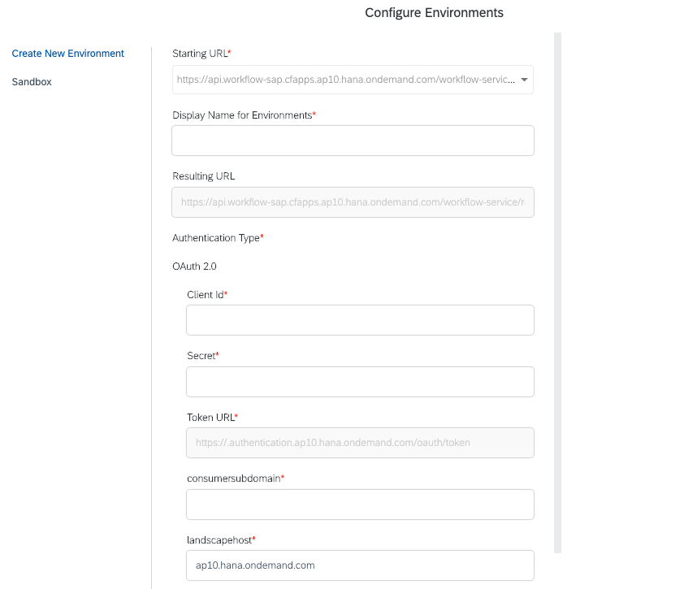

# Exercise 02 - Understand OAuth 2.0 at a high level

In this exercise you'll learn about OAuth, the open standard for access control, and specifically about how OAuth, in its current version of 2.0, is used to protect and control access to SAP Cloud Platform API resources.


## Steps

After completing the steps in this exercise you'll have an understanding of how OAuth 2.0 is used to protect and control access to resources, preparing you to be able to make calls to SAP Cloud Platform APIs that are so protected.

### 1. Get an overview of OAuth 2.0

OAuth 2.0 is an industry standard, based on work within the context of the Internet Engineering Task Force (IETF) and codified in [RFC 6749 - The OAuth 2.0 Authorization Framework](https://tools.ietf.org/html/rfc6749). The abstract section in this RFC provides a decent overview, with which we can start:

_The OAuth 2.0 authorization framework enables a third-party
   application to obtain limited access to an HTTP service, either on
   behalf of a resource owner by orchestrating an approval interaction
   between the resource owner and the HTTP service, or by allowing the
   third-party application to obtain access on its own behalf._

> RFC stands for Request For Comments and is a type of formal document describing methods, behaviors, research and innovations that underpin the Internet and related systems and protocols.

Immediately we can see how OAuth 2.0 differs from, say, the use of HTTP Basic Authentication, which has been used in the past to protect and control access to API resources. How does this differ? Well, in many ways, but just to pick a couple:

- HTTP Basic Authentication requires the use of a username and password; once compromised, those credentials are hard to revoke cleanly and without causing issues for other systems with which they were shared

- Rather than just a resource and a username & password credential pair with HTTP Basic Authentication, the OAuth 2.0 approach identifies multiple actors in any given scenario - such as the resource owner, a third party application, and so on

At the beginning of the O'Reilly book [Getting Started with OAuth 2.0](https://www.oreilly.com/library/view/getting-started-with/9781449317843/) the author [Ryan Boyd](https://www.linkedin.com/in/ryguyrg/) describes this difference in a light-hearted manner by recounting a scene from the movie "Ferris Bueller's Day Off", where a valet parking attendant, given the keys to an expensive 1961 Ferrari (a [250 GT California Spyder](https://en.wikipedia.org/wiki/Ferrari_250#250_GT_California_Spyder_SWB), to be precise) to park, takes it out for a joyride instead of just parking it in the garage. Giving the valet the keys, and thereby full access to the car, is the equivalent of using a username & password based authentication mechanism. Ideally the car owner would have given the valet limited access preventing such a scenario, by providing scope limited in time and features - not allowing access to driving at high speed, going further than a few hundred meters, or opening the glove compartment or trunk.

The idea of OAuth 2.0 is to facilitate delegated access via tokens; tokens that have a limited scope, a limited lifespan, and that are granted either directly or via interaction with a resource owner.


### 2. Understand the roles in OAuth 2.0

As mentioned in the previous step, there are multiple actors at play in an OAuth 2.0 scenario. These actors have different roles, and they can be summarized as follows:

- **Client**: the application that requires access to resources

- **Resource Server**: where the resources are, i.e. where the endpoints are that the Client wishes to consume

- **Resource Owner**: the owner of the resources to which access is required; ultimately, this might be a system, or a human

- **Authorization Server**: A server that (in the case where approval or denial of delegated access requires a decision by a human Resource Owner) presents an interface to approve or deny access requests, and that also issues and renews access tokens

In some circumstances the Authorization Server and the Resource Server might be the same and combined into one; in the context of SAP Cloud Platform however they are usually separate.


### 3. Understand OAuth 2.0 grant types

OAuth 2.0 has been designed to protect and control access to resources in different scenarios, where some or all of the roles described in the previous step are involved.

In the context of OAuth 2.0, protection of SAP Cloud Platform APIs is achieved in the context of different grant types. These grant types are specific scenarios that each describe what type of approach, or flow, is used that results in the granting of an access token with the appropriate authorizations.

The OAuth 2.0 grant types (also known as "flows") are summarized here. It's worth having this simple and deliberately abstract (not specific to any particular grant type) protocol flow diagram in mind, which is taken from the RFC ([section 1.2](https://tools.ietf.org/html/rfc6749#section-1.2)) and shows the different actors and exchanges:

```
     +--------+                               +---------------+
     |        |--(A)- Authorization Request ->|   Resource    |
     |        |                               |     Owner     |
     |        |<-(B)-- Authorization Grant ---|               |
     |        |                               +---------------+
     |        |
     |        |                               +---------------+
     |        |--(C)-- Authorization Grant -->| Authorization |
     | Client |                               |     Server    |
     |        |<-(D)----- Access Token -------|               |
     |        |                               +---------------+
     |        |
     |        |                               +---------------+
     |        |--(E)----- Access Token ------>|    Resource   |
     |        |                               |     Server    |
     |        |<-(F)--- Protected Resource ---|               |
     +--------+                               +---------------+
```

**Authorization Code**

This normally involved a request, initiated by the Client, to a human Resource Owner, asking them to grant access. If the access request is approved, an authorization code is returned to the Client, which then contacts the Authorization Server to ask for the code to be exchanged for an access token, which can then be used to authenticate calls to the appropriate endpoints on the Resource Server. Note that at no time in this grant type does the Client see or use the Resource Owner's (username & password) credentials.

If you've ever been asked, on a web page, by e.g. Google or GitHub, to allow access by a third party app to some of your resources, then you've participated as a Resource Owner in this flow.

**Client Credentials**

One can almost see this as the other side of the coin to the Authorization Code grant type, in that the attainment of an access token is still the key goal, but this time the flow is outside the context of any human involvement. In other words, this is where the Client (the script or program that is to make calls to the APIs) is acting on its own behalf, rather than on behalf of any Resource Owner (think of it as if the Client in this case is also the Resource Owner). In this flow, the Client provides its own credentials in the form of a "client ID" & "client secret" pair of values.

This is a very common grant type used for access to SAP Cloud Platform APIs, especially for automated and "headless" activities in the context of scripts and other autonomous programs.

**Implicit**

This grant type was designed as a simple authorization code flow optimized for browser-based scripts (written typically in JavaScript), where the number of round trips between actors are minimized. Clients are granted access tokens directly, where no intermediate authorization codes are issued. This is not used in the context of SAP Cloud Platform APIs and is considered legacy and not recommended any more.

**Resource Owner Password Credentials**

Also known simply as the "Password" grant type, this is a flow designed for use in the situation where there is strong trust between the Client and the Resource Owner - more specifically, when the Resource Owner trusts the Client (application) so much that they are willing to give their username & password credentials to the Client, which can then use them to request an access token. One redeeming feature of this grant type is that the Client does not have to store the credentials, as the access token granted can be long-lived, and / or the lifetime of the token can be extended by use of a refresh token.

While this grant type is also considered legacy, it is used currently to protect the [Cloud Management APIs on SAP Cloud Platform](https://help.sap.com/viewer/65de2977205c403bbc107264b8eccf4b/Cloud/en-US/3670474a58c24ac2b082e76cbbd9dc19.html), so worth understanding, at least for the moment.


### 4. See where these grant types are used for APIs on SAP Cloud Platform

Remember in the previous exercise, at the end of each of the steps, you looked briefly at what was required to obtain authentication for calls to the APIs? In this step we'll revisit those points in the context of what we now know about OAuth 2.0.

:point_right: Revisit the [Workflow API for Cloud Foundry](https://api.sap.com/api/SAP_CP_Workflow_CF/resource) page (make sure you're still logged in to the API Hub) and look again at the "Configure Environments" facility. You should see a form that looks something like this, in the context of saving a set of values to define a new API credentials environment:



> The "consumersubdomain" and "landscapehost" properties aren't OAuth 2.0 specific, they are two properties that help towards making up the "Token URL" property value, which represents the OAuth 2.0 token endpoint on the Authorization Server.

The only possible "Authentication Type" is OAuth 2.0 and with the requirement of "Client Id" and "Secret" values, we can (correctly) deduce that this is the Client Credentials grant type. Directly below those two fields we also see the "Token URL" field which is an endpoint on the Authorization Server (see the roles earlier in this exercise).

:point_right: Revisit the [Authorization](https://help.sap.com/viewer/65de2977205c403bbc107264b8eccf4b/latest/en-US/3670474a58c24ac2b082e76cbbd9dc19.html) link from the Core Service APIs page, which leads to the "Manage Authentication and Authorization Process for Cloud Management APIs" page in the SAP Help Portal. Here you'll see, currently, that the "_core service APIs of SAP Cloud Platform are protected with the OAuth 2.0 Password Grant type_". The process described further down on that page shows the use of this grant type, with the supply of the Resource Owner's username and password credentials.

> The use of this legacy grant type will be replaced by the use of the Client Credentials grant type in the future.

:point_right: Revisit the authentication requirements for the Enterprise Messaging "management" APIs, by going back to the [Use REST APIs to Manage Queues and Queue Subscriptions](https://help.sap.com/viewer/bf82e6b26456494cbdd197057c09979f/Cloud/en-US/00160292a8ed445daa0185589d9b43c5.html) resource in the SAP Help Portal. In the few moments that you spent staring at this, you may have come across this in the Procedure section:

```
grant_type=client_credentials&response_type=token
```

This indeed confirms that the Client Credentials grant type is used to protect the resources for the "management" APIs (and the "messaging" APIs too - see the equivalent section in [Use REST APIs to Send and Receive Messages](https://help.sap.com/viewer/bf82e6b26456494cbdd197057c09979f/Cloud/en-US/577ea7ce5cef4e2ea974c03d5549b3ff.html)).

## Summary

Great, now you understand some key concepts in OAuth 2.0, including roles and grant types, and can relate these to how APIs in SAP Cloud Platform are protected. At this point you're ready to make your first SAP Cloud Platform API calls to endpoints protected with OAuth 2.0.
