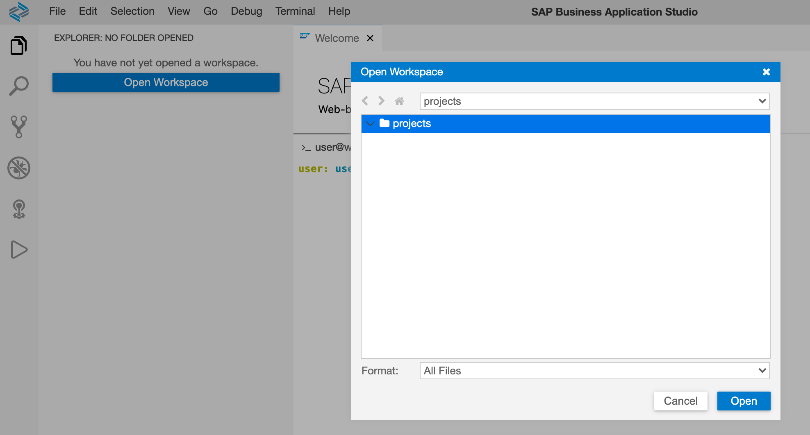
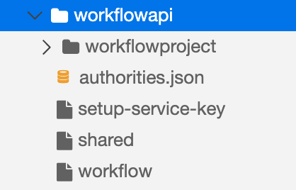
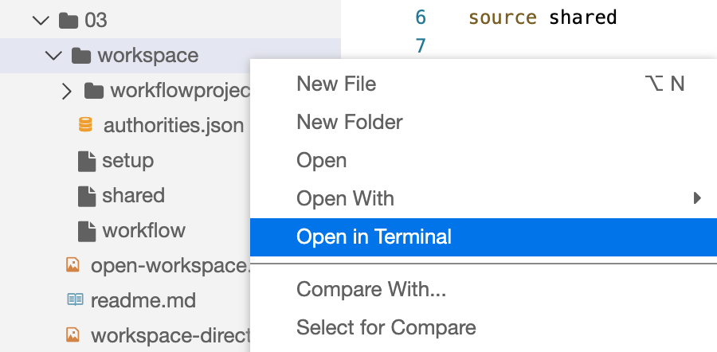
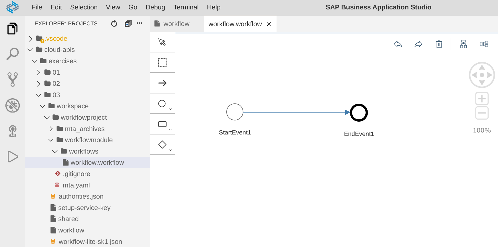
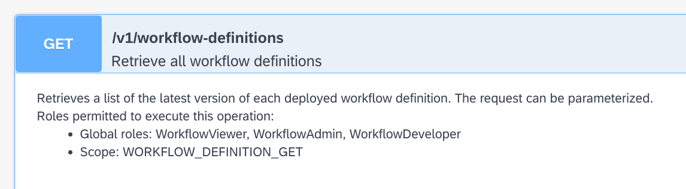
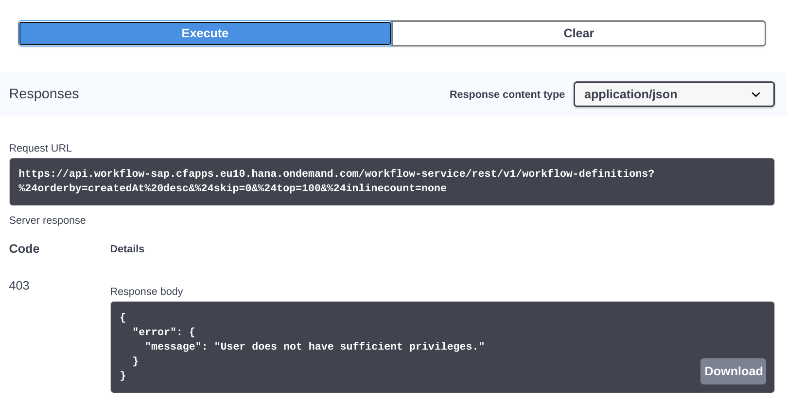

# Exercise 03 - Setting up for and calling Workflow APIs

In this exercise you'll set up everything you need for exploring the Workflow APIs and learning about how to use them. Specifically you'll prepare your dev space in the App Studio (details of which were listed in the [prerequisites](../../prerequisites.md)), install a couple of extra tools there, and then clone this repo and connect to your CF organization and space.

## Steps

Because you're awesome and you've already set up your dev space according to the [prerequisites](../../prerequisites.md), with the "MTA Tools" and "Workflow Management" SAP extensions installed, you're almost ready to dive into the APIs. First though, as we'll be interacting with the Workflow API from the command line within your App Studio dev space and learning about it that way, we'll install a couple of tools there to help us. We'll also


### 1. Add the `jq` tool to your App Studio dev space

We'll be dealing with JSON in this exercise, and [`jq`](https://stedolan.github.io/jq/) is a great way to parse it and extract values, on the command line and in shell scripts. We need to download the appropriate executable to our dev space environment, and we can do this by looking for the download link and using that in our dev space's terminal.

:point_right: Open up a new terminal with menu path **Terminal → New Terminal** or with keyboard shortcut ``Ctrl-` `` and create a directory in which to put this locally installed executable:

```shell
> mkdir -p $HOME/.local/bin/
```

> With all these shell prompt instructions, note that the real shell prompt that you are likely to see (such as `user: user $`) is not shown; instead, we just show `>` to keep things simple.

:point_right: Now download the executable, getting the link from the [download page](https://stedolan.github.io/jq/download/), specifically the one for the latest `jq` Linux 64-bit binary. Currently that is for `jq` version 1.6, and the URL is as shown here in the command invocation:

```shell
> curl -L https://github.com/stedolan/jq/releases/download/jq-1.6/jq-linux64 > $HOME/.local/bin/jq
```

Here's typical output that you might see:

```
  % Total    % Received % Xferd  Average Speed   Time    Time     Time  Current
                                 Dload  Upload   Total   Spent    Left  Speed
100   632  100   632    0     0  15047      0 --:--:-- --:--:-- --:--:-- 15047
100 3861k  100 3861k    0     0  2690k      0  0:00:01  0:00:01 --:--:-- 3144k
```

:point_right: Make the downloaded `jq` file executable:

```
> chmod +x $HOME/.local/bin/jq
```

In order to be able to find this executable and run it, we need to add its location (the `$HOME/.local/bin/` directory) to our PATH; a convenient way to do this is to append a line to our `.bashrc` file, which is executed when we start a new Bash shell (which is when we open a new terminal in our dev space).

:point_right: Append a line to your `.bashrc` file like this (_make sure you use TWO greater-than signs, not just one, otherwise you'll overwrite rather than append to the file!_):

```
> echo 'export PATH=$HOME/.local/bin/:$PATH' >> $HOME/.bashrc
```

Now, opening up a new terminal, you'll be able to run jq:

```
> jq
jq - commandline JSON processor [version 1.6]

Usage:  jq [options] <jq filter> [file...]
        jq [options] --args <jq filter> [strings...]
        jq [options] --jsonargs <jq filter> [JSON_TEXTS...]
...
```

### 2. Add the `jwt-cli` tool to your App Studio dev space

We'll be creating OAuth 2.0 access tokens in the course of this exercise, which appear as long opaque strings of characters. But we can actually "parse" the tokens, with the help of a JSON Web Token (JWT) command line tool.

The [`jwt-cli`](https://www.npmjs.com/package/jwt-cli) tool is available for Node.js and can be installed globally within your shell using the `--global` switch for the `npm` command.

:point_right: At your shell prompt in the terminal, install `jwt-cli` globally like this:

```shell
> npm install --global jwt-cli
```

You should see output like this (some lines omitted for brevity):

```
/home/user/.node_modules_global/bin/jwt -> /home/user/.node_modules_global/lib/node_modules/jwt-cli/bin/jwt.js
[...]

+ jwt-cli@1.2.3
added 25 packages from 26 contributors in 2.563s
```

Because the dev space container already contains Node.js and `npm`, that's all you need to do.

:point_right: Check that you can execute the tool, by entering `jwt` at the prompt. You should see output similar to what's shown here:

```
> jwt
jwt-cli - JSON Web Token parser [version 1.2.3]

Usage: jwt <encoded token> --secret=<signing secret>

ℹ Documentation: https://www.npmjs.com/package/jwt-cli
⚠ Issue tracker: https://github.com/troyharvey/jwt-cli/issues
```


### 3. Clone and open this repository in your App Studio dev space

This repository (repo for short) contains some scripts that have been written for you, to help you get to know the Workflow APIs from the bottom up. So that you can run these scripts in the context of your App Studio dev space, it's now time to clone this repo there.

First, let's open the `projects/` directory as the workspace in your App Studio dev space.

:point_right: Use the **Open Workspace** button in the Explorer perspective and choose the `projects/` directory to open:



:point_right: Now, back in the terminal (you may need to open a fresh one), at the shell prompt, move into the `projects/` directory and then use `git` to clone the repo:


```shell
> cd $HOME/projects/
> git clone TODO-REPLACE-REPO-URL-HERE
```

Here's what the output should look like:

```
Cloning into 'TODO-cloud-apis'...
remote: Enumerating objects: 158, done.
remote: Counting objects: 100% (158/158), done.
remote: Compressing objects: 100% (111/111), done.
remote: Total 158 (delta 53), reused 118 (delta 36), pack-reused 0
Receiving objects: 100% (158/158), 1.30 MiB | 3.26 MiB/s, done.
Resolving deltas: 100% (53/53), done.
```

> On opening up a new terminal after opening the `projects/` directory as the workspace, you may already have been put directly into the `projects/` directory, so the `cd $HOME/projects/` is not entirely necessary in this case (but it won't harm to run this command if you want to).

At this stage, you'll have the entire repo in your `projects/` directory, and you should see it in the Explorer area. It includes a directory called `workspace/` within the `exercises/03/` directory.

:point_right: Use the Explorer area to have a look around at the contents:



Here's a quick overview of what you see:

- `workflowproject/`: a directory containing a Multi-Target Application (MTA) which contains a workflow definition within a workflow module, that you'll be deploying to an instance of the Workflow service

- `authorities.json`: a JSON definition of scopes, or authorities, required when making some Workflow API calls

- `setup`: a simple script that uses the CF command-line client `cf` to set up an instance of the Workflow service, and also a service key

- `shared`: an include with shared variable definitions

- `workflow`: the main script that will help you make Workflow API calls


### 4. Connect to your CF target

You're about to embark on a series of CF activities using the `cf` command line tool; for this, you'll need to be connected to your CF endpoint, targeting your CF organization and space. You can do this in one of two ways - either using the App Studio facility, or at the command line with the `cf` command itself. Here are both ways, just pick one.

> If the message in the bottom bar of the App Studio already states that your CF organization and space is targeted, then you can skip this step.

**Using the App Studio facility**

:point_right: Select the message in the bottom bar of the App Studio that says something like "_The organization and space in Cloud Foundry have not been set_". This will initiate a short wizard that will guide you through connecting to, authenticating with, and choosing an organization and space within, your CF endpoint. Make sure to connect to the CF environment that was set up in relation to your SAP Cloud Platform trial account as described in the [prerequisites](../prerequisites.md).

**At the command line**

:point_right: At the shell prompt of a terminal session in your dev space, use `cf login` like this and substitute the sample values with your own:

```
> cf login
API endpoint: https://api.cf.eu10.hana.ondemand.com

Email: me@example.com

Password:
Authenticating...
OK

Targeted org xyz12345trial

Targeted space dev

API endpoint:   https://api.cf.eu10.hana.ondemand.com (API version: 3.86.0)
User:           me@example.com
Org:            xyz12345trial
Space:          dev
```

### 5. Create a Workflow service instance

These steps assume you have a freshly created trial account on SAP Cloud Platform, and in particular, no existing Workflow service instance. If you do have such an instance already, you can either use that (and adapt the instructions here to suit) or remove it\* and follow the full instructions here.

\*Only remove an existing instance if you have no more use for it.

For this and subsequent steps, some of the commands needed have been made available in small scripts in the `workspace/` directory within the repo's `exercises/03/` directory. It's worth moving to that `workspace/` directory now as the rest of the exercise activities will involve being in there too.

:point_right: Move to the `workspace/` directory. You can either do this at the shell prompt directly with the `cd` command:

```shell
> cd $HOME/projects/cloud-apis/exercises/03/workspace/
```

Or you can use the App Studio's Explorer context menu as shown here:



Either way, you should end up in the `workspace/` directory.

Now it's time to create the instance of the Workflow service, using the 'lite' service plan. The name of the service, the service plan, and what to call the service instance, are stored in a `shared` script file, which you should first source into your shell. Then you can run the `cf` command as shown.

:point_right: First, source the common values, and check by echoing one of the values to STDOUT:

```shell
> source shared
> echo $plan
lite
>
```

:point_right: Now, directly following the previous commands, in the same shell process, create the service instance (typical output from this is shown here too):

```shell
> cf create-service $service $plan $instance
Creating service instance workflow-lite in org xyz12345trial / space dev as me@example.com...
OK

Create in progress. Use 'cf services' or 'cf service workflow-lite' to check operation status.
```

Note that this creation process is asynchronous, and, as it suggests, you should check for the eventual creation as shown:

```shell
> cf service $instance
Showing info of service workflow-lite in org xyz12345trial / space dev as me@example.com...

name:             workflow-lite
service:          workflow
tags:
plan:             lite
description:      Automate business processes using workflow technology.
documentation:    https://help.sap.com/viewer/p/WORKFLOW_SERVICE
dashboard:
service broker:   sm-workflow-broker-d2b48385-f83e-4601-9830-0db967aaa2f5

Showing status of last operation from service workflow-lite...

status:    create in progress
message:
started:   2020-09-15T13:52:00Z
updated:   2020-09-15T13:52:00Z

There are no bound apps for this service.

Upgrades are not supported by this broker.
```

Output like this ("create in progress") indicates that the instance is being created. Be patient, and wait for the status to show "create succeeded".

> You could have used the literal value "workflow-lite" in the `cf service` command above, but it's worth being consistent and ensuring we all use the same values for the names of things.


### 6. Create a service key for the service instance

Now the service instance exists, it's time to create a service key, which will contain credentials that we'll need in the OAuth 2.0 flow later in this exercise. We need to request the creation of a service instance, and then copy the contents, stripped of any cruft, into a local file. The script `setup-service-key` will do this for you.

:point_right: Examine the `setup-service-key` script and once you're happy with what it does, run it and check the output, which is also shown here:

```shell
> ./setup-service-key
```

This is the sort of thing that you should see as output (some lines omitted for brevity):

```
./setup-service-key
Creating service key sk1 for service instance workflow-lite as me@example.com...
OK
```
```json
{
  "content_endpoint": "https://api.workflow-sap.cfapps.eu10.hana.ondemand.com/workflow-deploy/rest/internal/v1",
  "endpoints": {
    "workflow_odata_url": "https://api.workflow-sap.cfapps.eu10.hana.ondemand.com/workflow-service/odata",
    "workflow_rest_url": "https://api.workflow-sap.cfapps.eu10.hana.ondemand.com/workflow-service/rest"
  },
  "html5-apps-repo": {
    "app_host_id": "1365363a-6e04-4f43-876a-67b81f32306e,1a5b93af-f1af-4acf-aee0-8c6cc8d3f315,8964e911-e35d-4cfd-972e-08e681a2df0f,9ea7410f-80ea-4b19-bbf0-4fca238ef098"
  },
  "portal_content_provider": {
    "instance_id": "b87e14b7-ea72-4866-80b7-fe284e75e83a"
  },
  "saasregistryappname": "workflow",
  "sap.cloud.service": "com.sap.bpm.workflow",
  "uaa": {
    "apiurl": "https://api.authentication.eu10.hana.ondemand.com",
    "clientid": "sb-clone-b09d9fcf-a418-44c8-9589-deadbeef4cb7!b55889|workflow!b10150",
    "clientsecret": "bc8b5076-0452-4604-91de-3b8e656211d4$_Z-K-z-wnzzesk5J6LYkyk08PBVkaad3DJtMLqjYuCo=",
    "uaadomain": "authentication.eu10.hana.ondemand.com",
    "url": "https://xyz12345.authentication.eu10.hana.ondemand.com",
    "xsappname": "clone-b09d9fcf-a418-44c8-9589-ebabea654cb7!b55889|workflow!b10150",
    "zoneid": "fd03402e-58c7-4fb8-9443-5d0fa2a533f4"
  }
}
```

Here you can clearly see, thanks to the nice formatting from `jq`, the contents of the service key, including values for `clientid`, `clientsecret` and `url` within the `uaa` section, and for `workflow_rest_url` within the `endpoints` section.

> You can of course see the contents of this file in the App Studio editor by simply opening the file that was created (`workflow-lite-sk1.json`).


### 7. Deploy a simple workflow definition

Phew, that's a lot of setup, well done for making it to here. Hopefully you'll be now in a good position not only tool-wise but also mentally now to start exploring the Workflow API. In order to do that, we have a simple workflow definition that we can deploy to the Workflow service instance, and then use the API to look at that definition, and also start an instance of it. In this step we'll deploy that simple definition.

The definition is in a module inside an MTA project, in the `workflowproject/` directory. You can explore the contents of this project using the standard tools in App Studio if you wish. Note that if you open the workflow definition file itself in the App Studio editor, you'll perhaps be slightly underwhelmed, as it really is the simplest workflow definition:



But it will do for what we need.

We need to build the deployable artifact with the standard MTA build tool `mbt` (which is already available in the context of the App Studio shell sessions) and then deploy it with `cf`.

:point_right: Move to the `workflowproject/` directory; if you're already in the `workspace/` directory then a simple `cd workflowproject/` will do. Otherwise, you can use an absolute path:

```shell
> cd $HOME/TODO-cloud-apis/exercises/03/workspace/workflowproject/
```

:point_right: Build the deployable artifact:

```shell
> mbt build
```

This should result in some output that looks like this:

```
[2020-09-16 09:01:19]  INFO Cloud MTA Build Tool version 1.0.15
[2020-09-16 09:01:19]  INFO generating the "Makefile_20200916090119.mta" file...
[2020-09-16 09:01:19]  INFO done
[2020-09-16 09:01:19]  INFO executing the "make -f Makefile_20200916090119.mta p=cf mtar= strict=true mode=" command...
[2020-09-16 09:01:19]  INFO validating the MTA project
[2020-09-16 09:01:19]  INFO validating the MTA project
[2020-09-16 09:01:19]  INFO building the "workflowmodule" module...
[2020-09-16 09:01:19]  INFO the build results of the "workflowmodule" module will be packaged and saved in the "/home/user/projects/cloud-apis/exercises/03/workspace/workflowproject/.workflowproject_mta_build_tmp/workflowmodule" folder
[2020-09-16 09:01:19]  INFO finished building the "workflowmodule" module
[2020-09-16 09:01:19]  INFO generating the metadata...
[2020-09-16 09:01:19]  INFO generating the "/home/user/projects/cloud-apis/exercises/03/workspace/workflowproject/.workflowproject_mta_build_tmp/META-INF/mtad.yaml" file...
[2020-09-16 09:01:19]  INFO generating the MTA archive...
[2020-09-16 09:01:19]  INFO the MTA archive generated at: /home/user/projects/cloud-apis/exercises/03/workspace/workflowproject/mta_archives/workflowproject_0.0.1.mtar
[2020-09-16 09:01:19]  INFO cleaning temporary files...
```

:point_right: Finally for this step, deploy the freshly built deployable artifact:

```shell
> cf deploy mta_archives/workflowproject_0.0.1.mtar
```

This should result in some output that will look similar to this:

```
Deploying multi-target app archive mta_archives/workflowproject_0.0.1.mtar in org xyz12345trial / space dev as me@example.com...

Uploading 1 files...
  /home/user/projects/cloud-apis/exercises/03/workspace/workflowproject/mta_archives/workflowproject_0.0.1.mtar
OK
Operation ID: 35c66db2-f7fb-11ea-874c-eeee0a80cc52
Deploying in org "xyz12345trial" and space "dev"
Detected MTA schema version: "3"
No deployed MTA detected - this is initial deployment
Detected new MTA version: "0.0.1"
Creating service key "workflowmodule-workflow_mta-credentials" for service "workflow-lite"...
Uploading content module "workflowmodule" in target service "workflow_mta"...
Deploying content module "workflowmodule" in target service "workflow_mta"...
Skipping deletion of services, because the command line option "--delete-services" is not specified.
Process finished.
Use "cf dmol -i 35c66db2-f7fb-11ea-874c-eeee0a80cc52" to download the logs of the process.
```

:point_right: Before continuing with the next steps, move back to the `workspace/` directory:

```shell
> cd ..
```

### 8. Set up an environment on the API Hub

So now we have a workflow definition deployed. We're going to try and list that via the API, from the API Hub. Looking in the API Hub to see the resource information for the [Workflow API for Cloud Foundry](https://api.sap.com/api/SAP_CP_Workflow_CF/resource), in the Workflow Definitions group (that we first encountered in [exercise 01](../01#1-get-an-introduction-to-the-sap-api-business-hub)) we see this HTTP method and endpoint:



Great, that seems to be what we want. We can make an API call to our own Workflow service instance from here, by defining a so-called "environment" with the appropriate endpoint and OAuth 2.0 settings.

:point_right: Make sure you're logged into the API Hub, and use the **Configure Environments** link to open up a dialog where you can define your target Workflow service instance environment via the information in the service key you created earlier. You should see a dialog like [the one we looked at in exercise 02](02#4-see-where-these-grant-types-are-used-for-apis-on-sap-cloud-platform).

In this dialog there are a number of properties you must specify. Apart from the name you want to give to this environment (which you can make up), all the values you need are in the service key JSON data.

:point_right: Get ready with the values, by looking at the service key contents. This is the file you created via the `setup-service-key` script earlier, and is called `workflow-lite-sk1.json` (or, via its dynamic variable name from the `shared` script, `$keyfile`). You can either look at the file in the regular App Studio editor, or use `jq` either for the whole file or for individual properties:

```shell
> source shared
> jq . < $keyfile                                 # show the entire file contents
> jq -r .endpoints.workflow_rest_url < $keyfile   # show the API endpoint
> jq -r .uaa.clientid < $keyfile                  # show the client ID
> jq -r .uaa.clientsecret < $keyfile              # show the client secret
> jq -r .uaa.url < $keyfile                       # show the auth server base URL
```

> using `source shared` just ensures that the variables in the `shared` file are set correctly, so you can use the dynamic name references such as `$keyfile`.

Here's an example of one of those invocations in action:

```shell
> jq -r .endpoints.workflow_rest_url < $keyfile   # show the API endpoint
https://api.workflow-sap.cfapps.eu10.hana.ondemand.com/workflow-service/rest
```

:point_right: Complete the properties in the dialog as follows:

|Property|Value|
|-|-|
|Starting URL|Must match the value of the `.endpoints.workflow_rest_url` property|
|Display name for Environment|Make a name up, like "My Env"|
|OAuth 2.0 Client Id|Must match the value of the `.uaa.clientid` property|
|OAuth 2.0 Client Secret|Must match the value of the `.uaa.clientsecret` property|
|OAuth 2.0 consumersubdomain|Must match the most significant part of the value of `.uaa.url`|
|OAuth 2.0 landscapehost|Must match the rest of the value of `.uaa.url` excluding "authentication"|

> The last two properties "consumersubdomain" and "landscapehost" must basically be so specified that the value for "Token URL" ends up being the value of `.uaa.url` with `/oauth/token` appended. Here's an example. If the value of the `.uaa.url` is `https://xyz12345trial.authentication.eu10.hana.ondemand.com` then the value for "consumersubdomain" is `xyz12345trial` (this value is also available in the `.uaa.identityzone` property) and the value for "landscapehost" is `eu10.hana.ondemand.com`.

:point_right: Mark the checkbox "Apply this environment to all APIs in this package that are not yet configured" and the radio button "Save this environment for future sessions" and choose Save.

You've now got an environment that is specific to you and your own Workflow service instance.


### 9. Try to make the API call

Now the moment of truth - making a GET request to the `/v1/workflow-definitions` API endpoint.

:point_right: While still logged into the API Hub, and your environment selected, find the endpoint and use the **Try out** link, which should present you with a large "Execute" button (you may have to scroll down a bit). Select that button, and have a look what happens.

You will most likely see something like this:



The HTTP response code returned (403), along with the message in the payload, might come initially as somewhat of a surprise. We can turn this surprise into an opportunity to dig into scopes (also known as "authorities"). The bottom line here is that while we've successfully authenticated, there aren't the appropriate permissions set on the service instance that we're using.

In the previous step we saw a short description of the `GET /v1/workflow-definitions` API resource, which included this part:

```
Scope: WORKFLOW_DEFINITION_GET
```


## Summary

At this point you're ...

