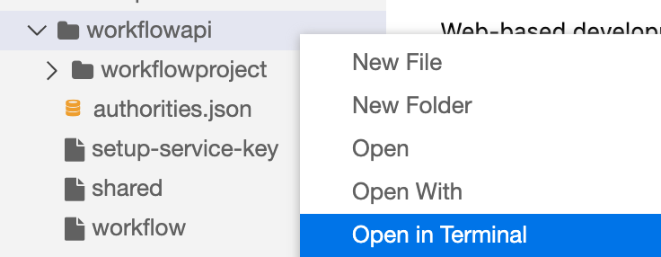
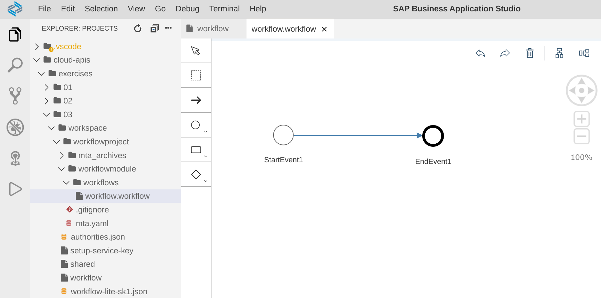

# Exercise 04 - Creating a Workflow service instance and deploying a definition

To experience the Workflow API we're going to need something to work with, so in this exercise you'll create an instance of the Workflow service and deploy a very simple definition to it. This will be then the focus of the Workflow API explorations.


## Steps

[1. Create a Workflow service instance](#1-create-a-workflow-service-instance)<br>
[2. Create a service key for the service instance](#2-create-a-service-key-for-the-service-instance)<br>
[3. Deploy a simple workflow definition](#3-deploy-a-simple-workflow-definition)

At the end of these steps you'll have a running Workflow service instance, along with a service key, and you'll also have a simple workflow defintion deployed to it.


### 1. Create a Workflow service instance

These steps assume you have a freshly created trial account on SAP Cloud Platform, and in particular, no existing Workflow service instance. If you do have such an instance already, you can either use that (and adapt the instructions here to suit) or remove it\* and follow the full instructions here.

\*Only remove an existing instance if you have no more use for it!

For this and subsequent steps, some of the commands needed have been made available in small scripts in the `workflowapi/` directory (within the `workspaces/` directory) in this repo that you've cloned. It's worth moving to that `workflowapi/` directory now as the rest of the exercise activities will involve being in there too.

:point_right: Move to the `workspaceapi/` directory. You can either do this at the shell prompt directly with the `cd` command:

```shell
> cd $HOME/projects/cloud-apis-virtual-event/workspaces/workflowapi/
```

Or you can use the App Studio's Explorer very convenient context menu as shown here:



Either way, you should end up in the `workflowapi/` directory.

Now it's time to create the instance of the Workflow service, using the 'lite' service plan. The name of the service, the service plan, and what to call the service instance, are stored in a `shared` script file, which you should first source into your shell. Then you can run the `cf` command as shown.

:point_right: First, source the common values, and check by echoing one of the values to STDOUT:

```shell
> source shared
> echo $plan
lite
>
```

:point_right: Now, directly following the previous commands, in the same shell process, create the service instance (typical output from this is shown here too):

```
> cf create-service $service $plan $instance
Creating service instance workflow-lite in org a52544d1trial / space dev as me@example.com...
OK

Create in progress. Use 'cf services' or 'cf service workflow-lite' to check operation status.
```

Note that this creation process may be performed asynchronously, and, as it might suggest, as it does here, you should check for the eventual creation as shown:

```shell
> cf service $instance
Showing info of service workflow-lite in org a52544d1trial / space dev as me@example.com...

name:             workflow-lite
service:          workflow
tags:
plan:             lite
description:      Automate business processes using workflow technology.
documentation:    https://help.sap.com/viewer/p/WORKFLOW_SERVICE
dashboard:
service broker:   sm-workflow-broker-d2b48385-f83e-4601-9830-0db967aaa2f5

Showing status of last operation from service workflow-lite...

status:    create in progress
message:
started:   2020-09-15T13:52:00Z
updated:   2020-09-15T13:52:00Z

There are no bound apps for this service.

Upgrades are not supported by this broker.
```

Output like this ("status: create in progress") indicates that the instance is being created. Be patient, and keep checking for the status to show "create succeeded".

> You could have used the literal value "workflow-lite" in the `cf service` command above, but it's worth being consistent and ensuring we all use the same values for the names of things.


### 2. Create a service key for the service instance

Now the service instance exists, it's time to create a service key, which will contain credentials that we'll need in the OAuth 2.0 flow later. We need to request the creation of a service key, and then copy the contents, stripped of any cruft, into a local file. The script `setup-service-key` will do this for you.

:point_right: Examine the `setup-service-key` script and once you're happy with what it does, run it like this:

```shell
> ./setup-service-key
```

This is the sort of thing that you should see as output (some lines in the JSON output omitted for brevity):

```
Creating service key sk1 for service instance workflow-lite as me@example.com...
OK
```

```json
{
  "content_endpoint": "https://api.workflow-sap.cfapps.eu10.hana.ondemand.com/workflow-deploy/rest/internal/v1",
  "endpoints": {
    "workflow_odata_url": "https://api.workflow-sap.cfapps.eu10.hana.ondemand.com/workflow-service/odata",
    "workflow_rest_url": "https://api.workflow-sap.cfapps.eu10.hana.ondemand.com/workflow-service/rest"
  },
  "html5-apps-repo": {
    "app_host_id": "1365363a-6e04-4f43-876a-67b81f32306e,1a5b93af-f1af-4acf-aee0-8c6cc8d3f315,8964e911-e35d-4cfd-972e-08e681a2df0f,9ea7410f-80ea-4b19-bbf0-4fca238ef098"
  },
  "portal_content_provider": {
    "instance_id": "b87e14b7-ea72-4866-80b7-fe284e75e83a"
  },
  "saasregistryappname": "workflow",
  "sap.cloud.service": "com.sap.bpm.workflow",
  "uaa": {
    "apiurl": "https://api.authentication.eu10.hana.ondemand.com",
    "clientid": "sb-clone-b09d9fcf-a418-44c8-9589-deadbeef4cb7!b55889|workflow!b10150",
    "clientsecret": "bc8b5076-0452-4604-91de-3b8e656211d4$_Z-K-z-wnzzesk5J6LYkyk08PBVkaad3DJtMLqjYuCo=",
    "uaadomain": "authentication.eu10.hana.ondemand.com",
    "url": "https://a52544d1trial.authentication.eu10.hana.ondemand.com",
    "xsappname": "clone-b09d9fcf-a418-44c8-9589-ebabea654cb7!b55889|workflow!b10150",
    "zoneid": "fd03402e-58c7-4fb8-9443-5d0fa2a533f4"
  }
}
```

Here you can clearly see, thanks to the nice formatting from `jq`, the contents of the service key, including values for `clientid`, `clientsecret` and `url` within the `uaa` section, and for `workflow_rest_url` within the `endpoints` section.

> You can of course see the contents of this file nicely formatted in the App Studio editor by simply opening the file that was created (`workflow-lite-sk1.json`).


### 3. Deploy a simple workflow definition

OK. There's only one more step here and then you'll be ready to start exploring the Workflow API. There's a simple workflow definition that we can deploy to the Workflow service instance, so that we can use that subsequently with calls to the API endpoints.

The definition is in a module inside an MTA project, in the `workflowproject/` directory. You can explore the contents of this project using the standard tools in App Studio if you wish. Note that if you open the workflow definition file itself in the App Studio editor, you'll perhaps be slightly underwhelmed, as it really is the simplest workflow definition that one could imagine:



But it will do for what we need.

We need to build the deployable artifact with the standard MTA build tool `mbt` (which is already available in the context of the App Studio shell sessions) and then deploy it with `cf`.

:point_right: Move to the `workflowproject/` directory; if you're already in the `workflowapi/` directory then a simple `cd workflowproject/` will do. Otherwise, you can use an absolute path:

```shell
> cd $HOME/projects/cloud-apis-virtual-event/workspaces/workflowapi/workflowproject/
```

:point_right: Build the deployable artifact:

```shell
> mbt build
```

This should result in some output that looks like this:

```
[2020-09-16 09:01:19]  INFO Cloud MTA Build Tool version 1.0.15
[2020-09-16 09:01:19]  INFO generating the "Makefile_20200916090119.mta" file...
[2020-09-16 09:01:19]  INFO done
[2020-09-16 09:01:19]  INFO executing the "make -f Makefile_20200916090119.mta p=cf mtar= strict=true mode=" command...
[2020-09-16 09:01:19]  INFO validating the MTA project
[2020-09-16 09:01:19]  INFO validating the MTA project
[2020-09-16 09:01:19]  INFO building the "workflowmodule" module...
[2020-09-16 09:01:19]  INFO the build results of the "workflowmodule" module will be packaged and saved in the "/home/user/projects/cloud-apis-virtual-event/workspaces/workflowapi/workflowproject/.workflowproject_mta_build_tmp/workflowmodule" folder
[2020-09-16 09:01:19]  INFO finished building the "workflowmodule" module
[2020-09-16 09:01:19]  INFO generating the metadata...
[2020-09-16 09:01:19]  INFO generating the "/home/user/projects/cloud-apis-virtual-event/workspaces/workflowapi/workflowproject/.workflowproject_mta_build_tmp/META-INF/mtad.yaml" file...
[2020-09-16 09:01:19]  INFO generating the MTA archive...
[2020-09-16 09:01:19]  INFO the MTA archive generated at: /home/user/projects/cloud-apis-virtual-event/workspaces/workflowapi/workflowproject/mta_archives/workflowproject_0.0.1.mtar
[2020-09-16 09:01:19]  INFO cleaning temporary files...
```

:point_right: Finally for this step, deploy the freshly built deployable artifact:

```shell
> cf deploy mta_archives/workflowproject_0.0.1.mtar
```

This should result in some output that will look similar to this:

```
Deploying multi-target app archive mta_archives/workflowproject_0.0.1.mtar in org a52544d1trial / space dev as me@example.com...

Uploading 1 files...
  /home/user/projects/cloud-apis-virtual-event/workspaces/workflowapi/workflowproject/mta_archives/workflowproject_0.0.1.mtar
OK
Operation ID: 35c66db2-f7fb-11ea-874c-eeee0a80cc52
Deploying in org "a52544d1trial" and space "dev"
Detected MTA schema version: "3"
No deployed MTA detected - this is initial deployment
Detected new MTA version: "0.0.1"
Creating service key "workflowmodule-workflow_mta-credentials" for service "workflow-lite"...
Uploading content module "workflowmodule" in target service "workflow_mta"...
Deploying content module "workflowmodule" in target service "workflow_mta"...
Skipping deletion of services, because the command line option "--delete-services" is not specified.
Process finished.
Use "cf dmol -i 35c66db2-f7fb-11ea-874c-eeee0a80cc52" to download the logs of the process.
```

:point_right: Before continuing any further, move back up to the `workflowapi/` directory, and check that you're in the right place:

```shell
> cd .. && pwd
```

The output from `pwd` should show you that you're in the `workflowapi/` directory:

```
/home/user/projects/cloud-apis-virtual-event/workspaces/workflowapi
```

## Summary

At this point you've got your own Workflow environment and workspace within which to explore the Workflow API. Good work!
