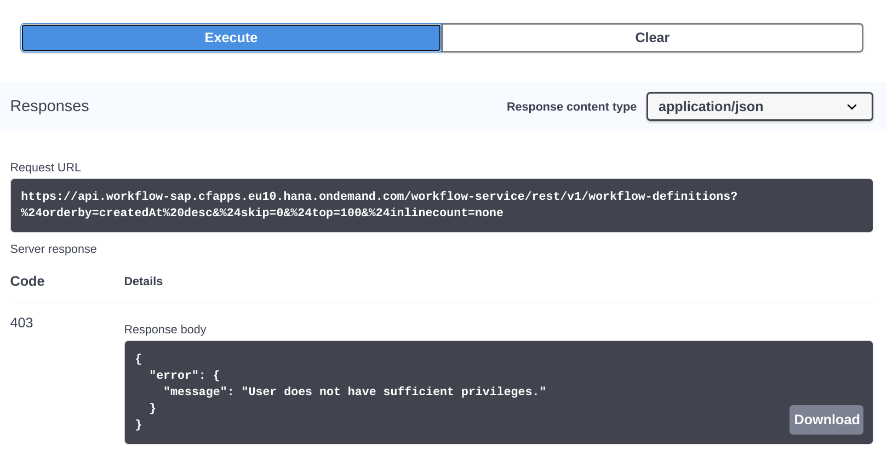

# Exercise 05 - Workflow API calls, scopes, access token contents & more

Thanks to the previous exercises, you have everything you need to make some Workflow API calls now. You have tools in your App Studio dev space that will enhance your experience, you have a workflow definition deployed to a Workflow service instance, and you have OAuth 2.0 authentication details in a service key that you will make use of now. In this exercise you'll make your first Workflow API call, and learn about scopes (aka "authorities") and the contents of access tokens. You'll make your first API call from the command line.

## Steps

After following the steps in this exercise, you'll have some familiarity with calling Workflow APIs, and will have gained some understanding of what's required to do so.

### 1. Prepare for your first Workflow API call

We have a workflow definition deployed. We're going to try and list that via the API.

:point_right: Jump over to the API Hub and look in there to see the resource information for the [Workflow API for Cloud Foundry](https://api.sap.com/api/SAP_CP_Workflow_CF/resource). In the Workflow Definitions group (that we first encountered in [exercise 01](../01#1-get-an-introduction-to-the-sap-api-business-hub)) we see this HTTP method and endpoint:


Great, that seems to be what we want. We can make this API call by sending an HTTP GET request to the `/v1/workflow-definitions` endpoint. This of course is just the path info, which is going to be relative to the fully qualified hostname and base path of the Resource Server. What is this? Well, we can look for it in the API Hub, by switching to the [details](https://api.sap.com/api/SAP_CP_Workflow_CF/overview) section, and identifying the Production URL appropriate to our environment:


:point_right: Make sure you're logged into the API Hub, and use the **Configure Environments** link to open up a dialog where you can define your target Workflow service instance environment via the information in the service key you created earlier. You should see a dialog like [the one we looked at in exercise 02](02#4-see-where-these-grant-types-are-used-for-apis-on-sap-cloud-platform).

In this dialog there are a number of properties you must specify. Apart from the name you want to give to this environment (which you can make up), all the values you need are in the service key JSON data.

:point_right: Get ready with the values, by looking at the service key contents. This is the file you created via the `setup-service-key` script earlier, and is called `workflow-lite-sk1.json` (or, via its dynamic variable name from the `shared` script, `$keyfile`). You can either look at the file in the regular App Studio editor, or use `jq` either for the whole file or for individual properties:

```shell
> source shared
> jq . < $keyfile                                 # show the entire file contents
> jq -r .endpoints.workflow_rest_url < $keyfile   # show the API endpoint
> jq -r .uaa.clientid < $keyfile                  # show the client ID
> jq -r .uaa.clientsecret < $keyfile              # show the client secret
> jq -r .uaa.url < $keyfile                       # show the auth server base URL
```

> using `source shared` just ensures that the variables in the `shared` file are set correctly, so you can use the dynamic name references such as `$keyfile`.

Here's an example of one of those invocations in action:

```shell
> jq -r .endpoints.workflow_rest_url < $keyfile   # show the API endpoint
https://api.workflow-sap.cfapps.eu10.hana.ondemand.com/workflow-service/rest
```

:point_right: Complete the properties in the dialog as follows:

|Property|Value|
|-|-|
|Starting URL|Must match the value of the `.endpoints.workflow_rest_url` property|
|Display name for Environment|Make a name up, like "My Env"|
|OAuth 2.0 Client Id|Must match the value of the `.uaa.clientid` property|
|OAuth 2.0 Client Secret|Must match the value of the `.uaa.clientsecret` property|
|OAuth 2.0 consumersubdomain|Must match the most significant part of the value of `.uaa.url`|
|OAuth 2.0 landscapehost|Must match the rest of the value of `.uaa.url` excluding "authentication"|

> The last two properties "consumersubdomain" and "landscapehost" must basically be so specified that the value for "Token URL" ends up being the value of `.uaa.url` with `/oauth/token` appended. Here's an example. If the value of the `.uaa.url` is `https://xyz12345trial.authentication.eu10.hana.ondemand.com` then the value for "consumersubdomain" is `xyz12345trial` (this value is also available in the `.uaa.identityzone` property) and the value for "landscapehost" is `eu10.hana.ondemand.com`.

:point_right: Mark the checkbox "Apply this environment to all APIs in this package that are not yet configured" and the radio button "Save this environment for future sessions" and choose Save.

You've now got an environment that is specific to you and your own Workflow service instance.


### 3. Try to make the API call

Now the moment of truth - making a GET request to the `/v1/workflow-definitions` API endpoint.

:point_right: While still logged into the API Hub, and your environment selected, find the endpoint and use the **Try out** link, which should present you with a large "Execute" button (you may have to scroll down a bit). Select that button, and have a look what happens.

You will most likely see something like this:



The HTTP response code returned (403), along with the message in the payload, might come initially as somewhat of a surprise. We can turn this surprise into an opportunity to dig into scopes (also known as "authorities"). The bottom line here is that while we've successfully authenticated, there aren't the appropriate permissions set on the service instance that we're using.

In the previous step we saw a short description of the `GET /v1/workflow-definitions` API resource, which included this part:

```
Scope: WORKFLOW_DEFINITION_GET
```


## Summary

At this point you're ...

