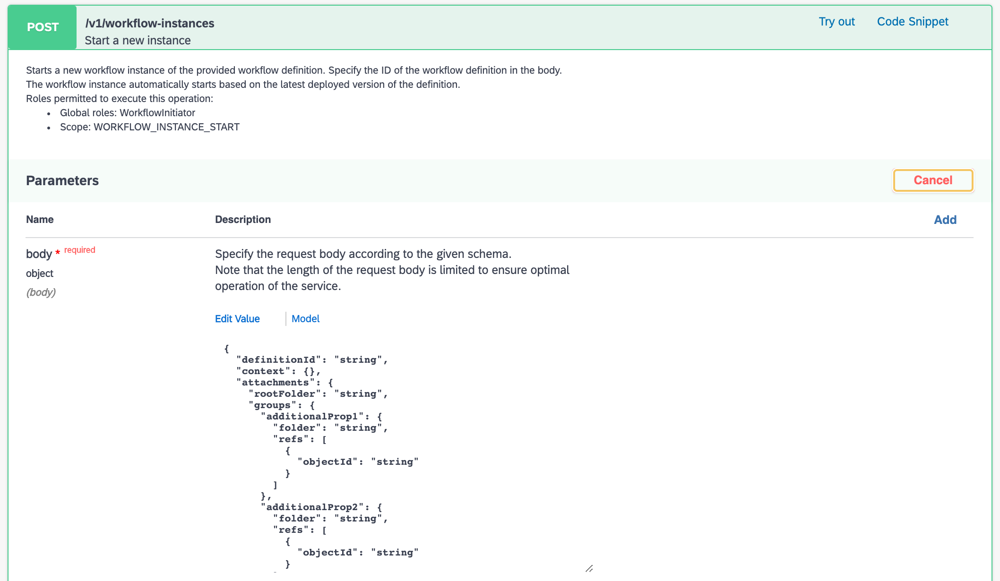
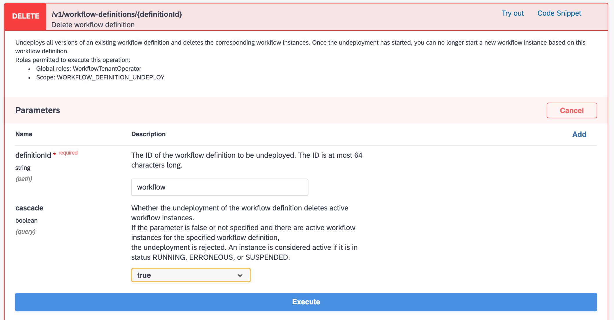

# Exercise 06 - Calling the Workflow API from within the SAP Business API Hub

Now we know how to find, authorize and make calls to Workflow API endpoints, let's try some calls in a different context. After all, API calls are just authenticated HTTP requests, so you can make them wherever you want.

The SAP Business API Hub (API Hub) not only provides information on API packages and APIs, but also provides you with the ability to maintain "environments" that reflect specific service instance and service key contexts. In this exercise you'll make some more Workflow API calls directly in the API Hub.

## Steps

[1. Create an environment in the API Hub](#1-create-an-environment-in-the-api-hub)<br>
[2. Make your first API call from within the API Hub](#2-make-your-first-api-call-from-within-the-api-hub)<br>
[3. Make a second API call](#3-make-a-second-api-call)<br>
[4. Make a final call to the Workflow API to delete the workflow definition](#4-make-a-final-call-to-the-workflow-api-to-delete-the-workflow-definition)

After following the steps in this exercise, you'll understand how to set up an environment in the API Hub and make API calls in that context.

:point-right: While you'll be working in the API Hub, you'll still need access to your App Studio dev space, so make sure you still have that open and a terminal available and in the `workflowapi/` directory.


### 1. Create an environment in the API Hub

At [the end of exercise 02](../02#4-see-where-these-grant-types-are-used-for-apis-on-sap-cloud-platform) we saw a glimpse of the "Configure Environments" facility in the API Hub. We'll use that in this step to define an environment that reflects the details of the service key contents we have in our service key file.

:point_right: Go to the [Workflow API for Cloud Foundry](https://api.sap.com/api/SAP_CP_Workflow_CF/resource) page in the API Hub, and make sure you're logged on.

:point_right: Select the **Configure Environments** link, and get ready to specify the details. Now you're familiar with OAuth 2.0 concepts, the content of service keys, and how the two things relate, it should be fairly straightforward to provide the appropriate values for the properties in the form. Apart from the name you want to give to this environment (which you can make up), all the values you need are in the service key JSON data.

:point_right: Get ready with the values, by looking at the service key contents. This is the file you created via the [`setup-service-key`](../../workspaces/workflowapi/setup-service-key) script in a previous exercise, and is called `workflow-lite-sk1.json` (or, via its dynamic variable name from the [`shared`](../../workspaces/workflowapi/shared) script, `$keyfile`).

You can either look at the file contents in the regular App Studio editor, or use `jq` either for the whole file or for individual properties. If you want to use the terminal (and remember, [#TheFutureIsTerminal](https://twitter.com/search?q=%23TheFutureIsTerminal&src=typed_query)!) then you can do it like this:

```shell
> source shared
> jq . < $keyfile                                 # show the entire file contents
> jq -r .endpoints.workflow_rest_url < $keyfile   # show the API endpoint
> jq -r .uaa.clientid < $keyfile                  # show the client ID
> jq -r .uaa.clientsecret < $keyfile              # show the client secret
> jq -r .uaa.url < $keyfile                       # show the auth server base URL
```

> using `source shared` just ensures that the variables in the `shared` file are set correctly, so you can use the dynamic name references such as `$keyfile`.

Here's an example of one of those invocations in action:

```shell
> jq -r .endpoints.workflow_rest_url < $keyfile   # show the API endpoint
https://api.workflow-sap.cfapps.eu10.hana.ondemand.com/workflow-service/rest
```

:point_right: Complete the properties in the API Hub's "Configure Environments" dialog as follows:

|Property|Value|
|-|-|
|Starting URL|Must match the value of the `.endpoints.workflow_rest_url` property|
|Display name for Environment|Make a name up, like "My Env"|
|OAuth 2.0 Client Id|Must match the value of the `.uaa.clientid` property|
|OAuth 2.0 Client Secret|Must match the value of the `.uaa.clientsecret` property|
|OAuth 2.0 consumersubdomain|Must match the most significant part of the value of `.uaa.url`|
|OAuth 2.0 landscapehost|Must match the rest of the value of `.uaa.url` excluding "authentication"|

> The last two properties "consumersubdomain" and "landscapehost" must basically be so specified that the value for "Token URL" ends up being the value of `.uaa.url` with `/oauth/token` appended. Here's an example. If the value of the `.uaa.url` is `https://a52544d1trial.authentication.eu10.hana.ondemand.com` then the value for "consumersubdomain" is `a52544d1trial` (this value is also available in the `.uaa.identityzone` property) and the value for "landscapehost" is `eu10.hana.ondemand.com`.

:point_right: Mark the checkbox "Apply this environment to all APIs in this package that are not yet configured" and the radio button "Save this environment for future sessions" and choose **Save**.

You've now got an environment that is specific to you and your own Workflow service instance.


### 2. Make your first API call from within the API Hub

Now to make your first call from within the API Hub. Let's start with listing any workflow instances, i.e. making a `GET` request to the `/v1/workflow-instances` API endpoint.

:point_right: While still logged into the API Hub, and your environment selected, find the endpoint (in the "Workflow Instances" group) and use the **Try out** link, which should present you with a large "Execute" button (you may have to scroll down a bit). Select that button to have the call made.

If you've defined the values in your environment appropriately, you should get the response that you're hoping for. First, as a bonus, you're shown the entire request URL, which will look something like this (split over a number of lines for readability):

```
https://api.workflow-sap.cfapps.eu10.hana.ondemand.com
  /workflow-service/rest/v1/workflow-instances
  ?%24orderby=startedAt%20desc
  &%24skip=0
  &%24top=100
  &%24inlinecount=none
```

> If you're curious about the encoding of the query string in this URL, you could use a local utility, or a service such as [urldecode.org](https://urldecode.org). Here, we see that [urldecode.org gives us the decoded version](https://urldecode.org/?text=%2524orderby%3DstartedAt%2520desc%26%2524skip%3D0%26%2524top%3D100%26%2524inlinecount%3Dnone&mode=decode) which looks like this: `$orderby=startedAt desc&$skip=0&$top=100&$inlinecount=none` (remember never to use an online service like this to encode or decode sensitive data).

Next, you are shown the HTTP status code and any response body. Here, the status code is 200 (OK) and there's an empty list represented by an empty JSON array, denoting "nothing in the list":

```json
[]
```

There's nothing listed because, as stated in the description of this endpoint, "_If no parameters are specified, all RUNNING, or ERRONEOUS instances are returned._".

Finally, you're also shown the HTTP response headers:

```
X-Frame-Options: DENY
Strict-Transport-Security: max-age=31536000; includeSubDomains; preload;
Cache-Control: no-cache,  no-store,  max-age=0,  must-revalidate
Server: SAP
X-Content-Type-Options: nosniff, nosniff
X-Xss-Protection: 1; mode=block
Vary: accept-encoding
Expires: 0
Pragma: no-cache
Date: Mon,  21 Sep 2020 12:20:23 GMT
X-Vcap-Request-Id: 10b42795-9d62-4507-6d06-c475a33c20eb
Content-Type: application/json
```


### 3. Make a second API call

Let's try another.

:point_right: In the same "Workflow Instances" group, find and select the API endpoint represented by a `POST` request to `/v1/workflow-instances`. That's right, in this call we'll start a new workflow instance.

Here we'll need to specify a payload which should contain, at the very least, a property denoting the ID of the workflow definition, and a property containing any context that should be supplied for the new instance. If you're wondering, this is exactly what was specified in the `start_workflow_instance` function in the `workflow` script that we used in the previous exercise in your App Studio's dev space. For reference, this is what the `curl` call looked like:

```bash
curl \
  --$output \
  --header "Authorization: Bearer $access_token" \
  --header "Content-Type: application/json" \
  --data "{\"definitionId\": \"$definition\", \"context\": {}}" \
  "$resourceserverapiroot/v1/workflow-instances" \
| jq .
```

What we see in this call, that we perhaps haven't seen in other calls, is the supply of some JSON data in the payload for this call (with the `--data` option). If you [stare at](https://langram.org/2019/04/08/es6-reduce-and-pipe/) the value passed with that `--data` option, you'll see it's just escaped JSON, that, when expanded, looks like this:

```json
{
  "definitionId": "...",
  "context": {}
}
```

We can see that in the equivalent call in the API Hub, we're presented with the need to specify a JSON value for the body (i.e. the payload), as shown:



The sample body is a more complex JSON structure, but for our purposes, all we need is what we specified in the previous exercise.

:point_right: Replace the sample body with this (below) and then select the large blue "Execute" button.

```json
{
  "definitionId": "workflow",
  "context": {}
}
```

The response is presented like before - with the Request URL that was used (again, split over multiple lines for readability):

```
https://api.workflow-sap.cfapps.eu10.hana.ondemand.com
  /workflow-service/rest/v1/workflow-instances
```

followed by the HTTP status code which is 201, and the response body, which looks something like this:

```json
{
  "id": "13e194d7-fc08-11ea-9e92-eeee0a9e5a06",
  "definitionId": "workflow",
  "definitionVersion": "1",
  "subject": "workflow",
  "status": "RUNNING",
  "businessKey": "",
  "startedAt": "2020-09-21T12:43:41.171Z",
  "startedBy": "sb-clone-b09d9fcf-a418-44c8-9589-ebabea654cb7!b55889|workflow!b10150",
  "completedAt": null
}
```

We also are given the HTTP response headers again.

We should feel fairly comfortable with this response, because we've seen it before in the previous exercise; then, and now, we just caught the freshly started instance in a "RUNNING" state, before it went pretty much immediately to "COMPLETED".


### 4. Make a final call to the Workflow API to delete the workflow definition

When you work with the Workflow service, and in particular the Monitor Workflows app, you'll notice that there is no facility for deleting workflow definitions in the UI. We can sort of understand this - it's quite a destructive thing to do. But we need to be able to do it somehow, and the API comes to our aid here. So let's round out this exercise, and our foray into the Workflow API, by finding and using the endpoint that allows us to delete a workflow definition.

:point_right: While still in the API Hub on the [Workflow API for Cloud Foundry](https://api.sap.com/api/SAP_CP_Workflow_CF/resource) page, find the endpoint that describes a `DELETE` request to the `/v1/workflow-definitions/{definitionId}` endpoint, expand it, and use the **Try out** facility again.



As shown, the ID of the workflow definition that you want to delete is required. You also have a choice as to whether to "cascade" the deletion, i.e. to delete active (i.e. running) instances of it. In this screenshot example, we've chosen the correct value for our workflow definition ID ("workflow") and opted to cascade the delete.

:point_right: Use the large blue "Execute" button, and check the result, which might not be what you're expecting ... but then again might be what you actually wanted.

The HTTP status code 403 is returned, signifying that we are not authorized. The payload that's returned confirms it:

```json
{
  "error": {
    "message": "User does not have sufficient privileges."
  }
}
```

We've seen this before and know what to do!

:point_right: Check the details of this API endpoint - what authority (scope) is required for this?

That's right, one that we haven't seen before, and one that is definitely not allocated to our Workflow service instance:


```
Scope: WORKFLOW_DEFINITION_UNDEPLOY
```

To fix this, flip back to your App Studio dev space, open the `authorities.json` file (in the `workflowapi/` directory) and add this new value to the list (don't forget to add a comma to the preceding line if you're adding this new authority to the end), so that the contents now look like this:

```json
{
    "authorities": [
        "WORKFLOW_DEFINITION_GET",
        "WORKFLOW_INSTANCE_GET",
        "WORKFLOW_INSTANCE_START",
        "WORKFLOW_DEFINITION_UNDEPLOY"
    ]
}
```

> Why are we _adding_ this new scope to the list? Because the `cf update-service` action is absolute, i.e. not relative / additive. If we were to update the service with merely a list of just this one new authority, the other three would disappear.

:point_right: Now, having ensured your changes to the `authorities.json` file are saved, open a terminal in the App Studio dev space, move to the appropriate directory, and run the command you used for this in the previous exercise:

```bash
> cd $HOME/projects/cloud-apis-virtual-event/workspaces/workflowapi/
> ./workflow add_authorities authorities.json
```

You'll get a brief response like before:

```
Updating service instance workflow-lite as me@example.com...
OK
```

:point_right: Finally, back in the API Hub, try the "Execute" button again. The API call should now be successful, and you should be presented with the appropriate output, i.e. a positive HTTP response. The response code is 202, appropriate for a DELETE action; there is no payload (as there's nothing to send back), but of course there are headers that you can inspect, as with any HTTP response:

```
X-Frame-Options: DENY
 Strict-Transport-Security: max-age=31536000; includeSubDomains; preload;
 Cache-Control: no-cache,  no-store,  max-age=0,  must-revalidate
 Server: SAP
 X-Content-Type-Options: nosniff, nosniff
 X-Xss-Protection: 1; mode=block
 Expires: 0
 Pragma: no-cache
 Content-Length: 0
 Date: Mon,  21 Sep 2020 13:04:55 GMT
 X-Vcap-Request-Id: 53a6822e-354f-4abf-4ee9-f7b87892a5e5
 Location: /workflow-service/rest/v1/jobs/bb66fb4f-b445-47b5-b82b-ba6906d1ba2b
```

That's it - you've made an API call to clean up after yourself by removing the workflow definition you deployed in an earlier exercise. Well done!


## Summary

At this point you should be quite familiar with the Workflow API, and comfortable with how calls are authorized and made. You've covered a lot of ground by getting to this point, well done!


## Questions

1. In the urldecoded query string, we see parameters such as `$orderby`, `$top` and `$skip`. What are you reminded of?

1. When making the `GET` request to the `/v1/workflow-instances` endpoint here, we got an empty list in response. Why does that look different to the response we got in the previous exercise to the same call (hint: what parameter values have been specified in both cases)?

1. In the response to `POST /v1/workflow-instances`, what does the particular HTTP 201 status code signify, and why?

1. What is the significance of the HTTP 202 status code, and which header in the response is important in this regard?

1. What do you think is happening behind the scenes in the API Hub when making calls in the context of a defined environment? Might our experience in step 4 make us consider the logic that is being used?
